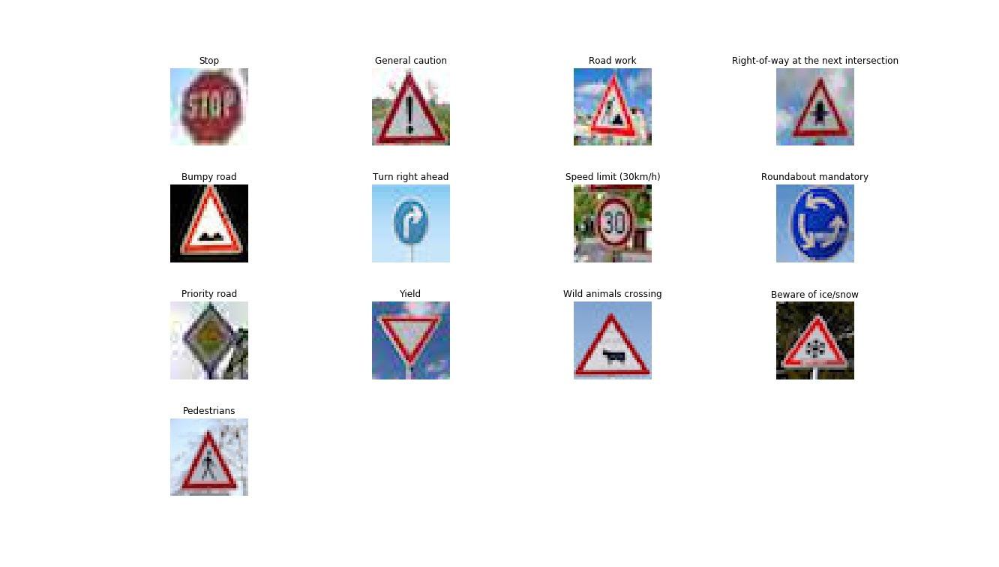

# **Traffic Sign Recognition** 

## Writeup Report

[//]: # (Image References)

[hist_train]: ./writeup-examples/hist_train.jpg "Training Set Representation per Label"
[hist_valid]: ./writeup-examples/hist_valid.jpg "Validation Set Representation per Label"
[hist_test]: ./writeup-examples/hist_test.jpg "Test Set Representation per Label"
[imgs_test]: ./writeup-examples/internet-examples.jpg "13 Downloaded Images for Testing"
[piecharts]: ./writeup-examples/pie_chars.jpg "Pie Charts Representing the Top 5 Predictions per Image"
[sign_color]: ./writeup-examples/sign_color.png "'Go straight or right' Traffic Sign in Color"
[sign_grey]: ./writeup-examples/sign_grey.png "'Go straight or right' Traffic Sign in GrayScale"
[conv2_vis]: ./writeup-examples/conv2_visual.jpg "Conv2 Feature Map Visual"
[conv2_img]: ./writeup-examples/conv2_img.jpg "Conv2 Image run"

This report regards a Traffic Sign Classifier project: and here is a link to my [project code](https://github.com/mashraf94/Traffic-Sign-Classifier-Project/blob/master/Traffic_Sign_Classifier_Project2.ipynb)

I used the numpy library to calculate summary statistics of the traffic
signs data set:

* The size of training set is 34799 image
* The size of the validation set is 4410 image
* The size of test set is 12630 image
* The shape of a traffic sign image is 32x32 for 3 color channels: RGB
* The number of unique classes/labels in the data set is 43 classes

Here is an exploratory visualization of the data set using bar charts to represent the number of images for each label within the data sets. Through these representations, we'd realize that, specially the training data set, has huge variances in the density of data images per label. This had a huge impact throughout the visualization of the network's feature maps, since the activations for the low density labels were a lot more vague than others with high densities.

Training Set Representation per Label:

![alt text][hist_train]

Validation Set Representation per Label:

![alt text][hist_valid]

Test Set Representation per Label:

![alt text][hist_test]

## Data Preprocessing
1. Convert the images to grayscale using the OpenCV library:
     * Decreased the computational complexity of the model 
     * Made the model more focused on the shapes defining each traffic sign, while reducing the color noise in each image. 
        - Nonetheless, I tried running the model using the three color channels, and it was a lot slower and scored lower accuracies.

2. Used the OpenCV library for Histogram Equalization:
       * increase the global contrast of the images, enhancing the intensity distribution throughout each image.

Here is an example of a 'Go straight or right' sign image before and after grayscaling, and histogram equalization.

![alt text][sign_color]                                            ![alt text][sign_grey]

3. Tried a Gaussian Blur from OpenCV to reduce any noise in the data:
     * Reduced the performance of the network, since it reduced the resolution of the images.
     * The gaussian blur preprocessing failed to improve the network's efficiency hence was removed.
  
4. Normalizing the data using the OpenCV Library Min-Max Normalization:
      * Reduced the pixels values between -1. and 1. to centralize the data around the origin
      * Reduced the data's mean and standard deviation for better and more valuable training.
        - Manipulated the alpha=-1. and beta=1. but other variations caused a drastic change in validation and test accuracies

5. Shuffling the entire data set, and labels, using the sklearn library:
     * Randomly shuffling the data for training to attain a random distribution throughout each batch for Stochastic Gradient Descent.
     * The shuffling had a major role in the training of the model and a huge impact on the network's accuracy.

## Model Architecture
This model architecture follows the implementation of the LeNet CNN.

My final model consisted of the following layers:

| Layer         		|     Description	        					| 
|:---------------------:|:---------------------------------------------:| 
| Input         		| 32x32x1 --  Grayscaled image   							| 
| Convolution 5x5     	| 1x1 stride + VALID padding + outputs 28x28x6 	|
| RELU					|												|
| Max pooling	      	| 2x2 stride + outputs 14x14x6 				|
| Convolution 5x5	    | 1x1 stride + VALID padding + outputs 10x10x16 	|
| RELU					|												|
| Max pooling	      	| 2x2 stride + outputs 5x5x16 				|
| Fully connected		| 120 unit        									|
| RELU					|												|
| Dropout				| 0.5 keep_prob        									|
| Fully connected		| 83 unit        									|
| RELU																	|
| Dropout				| 0.5 keep_prob        									|
|	Output					|	43 Logits											|
 

## Model Training
### Tuned Parameters
The choice of these hyperparameters required several trials to reach this final combination which represents the maximum performance achieved.
1. Epochs # 15   --------- Chosen upon the fact that the model reaches a plateau by the 15th epoch
2. Batch Size # 128  --------- Appropriate and efficient batch size     
3. Learning Rate = 0.001 --------- Through many tests, this learning rate was right before overshooting, nonetheless fast and converges
4. Mean = 0.  &  Standard Deviation = 0.1 --------- Values fed for the tf.truncated_normal() function for weight initialization 
5. Dropout = 0.5 --------- The probability for the dropout layers which decreased vastly the overfitting of the dataset

    * Used the tf.nn.softmax_cross_entropy_with_logits() function to calculate the logits probabilities using: softmax + the cross entropy 
    * Used the Adam Optimizer for training the network with backpropagation and stochastic gradient descent.

## Model Performance
My final model results were:
* Validation Set Accuracy = 95.44 % 
* Test Set Accuracy = 93.51 %

## Model Tuning and Performance Enhancing
1. Implemented the LeNet convolutional neural network, for it's simplicity and low computational cost.
    * Produced low accuracies and incompetent performance, due to overfitting of the training dataset.
2. Implemented the VGG "Visual Geometric Group" convolutional network, which is known for it's state-of-art performance on image recognition task.
    * The VGG implementation acquired significantly higher performance than LeNet with colored photos
    * VGG was significantly expensive computationally for its complexity since it had wider layers and it was deeper than LeNet 
           + VGG could only run on an AWS GPU instance.
3. Although VGG is a far more powerful network than LeNet it was costy, therefore I tried manipulating the dataset and LeNet implementation to achieve a close performance to VGG with a way more simplistic model.
     * **Steps**:
          1. Changed images to grayscale, and applied a histogram equalization so the network could focus on the main features in each traffic sign
         2. Through an iterative approach, used several normalization techniques to acquire the highest performance of the network.
          3. Reduced overfitting by adjusting the network and introducing 2 dropout layers following each fully connected layer.
               * The Dropout Layer was the major enhancement to the network's performance, since the network was trained not to depend on specific weights, by dropping randomly half the fully connected layers.
          4. Tried introducing a third convolutional layer to the network, but it didn't affect the network's performance at all.
          5. Tested Average Pooling instead of Max Pooling, yet Max Pooling acquired higher performance.
          5. Tuning the learning rate from ranges 0.0001 - (Didn't Converge) to 0.01 (Was obviously Overshooting)
          6. Tuning the number of epochs for the model to converge.
          7. Tuning the dropout layer keep_prob parameter, 0.75 was still overfitting the dataset.
          8. Finalized the model.
 

## Testing the Model on New Images
### Introduction to the Chosen Images
##### These are thirteen German traffic signs that I found on the web:

The first image might be difficult to classify because it is filling the whole image extensively which looks nothing like the training images, however this tests the networks capabilities of identifying the word 'STOP'.

The second, fourth and tenth images are difficult since all of them have the signs skewed with a different angle, and not straight forward like the training data set.

The fifth, seventh, eighth and ninth images contain intense color noise in the background and had either dirt or an irregularity on top of the sign in the image 

The third, eleventh, twelfth and thirteenth image all had high detailed traffic signs with complicated symbols that could be hard to determine using a simple network as LeNet.

The sixth image is a 'Right Ahead' sign which is blue, and the image shows the sign with a blue similar background, which might be challenging for the network to determine the edges of the sign.

### Prediction Results

| Image			        |     Prediction	        					| 
|:---------------------:|:---------------------------------------------:| 
| Stop Sign      		| Stop sign   									| 
| General Caution     			|  General Caution  										|
| Road Work					| Road Work											|
| Right-of-way at the next intersection |  Right-of-way at the next intersection |
| Bumpy Road | Bumpy Road |
| Turn Right Ahead | Turn Right Ahead |
| Speed Limit (30km/h) | Speed Limit (30km/h) |
| Roundabout Mandatory | Roundabout Mandatory | 
| Priority Road | Priority Road |
| Yield					| Yield											|
| Wild Animals Crossing | Bumpy Road |
| Beware of ice/snow | Beware of ice/snow |
| Pedestrians | Pedestrians |

The model was able to correctly guess 12 of the 13 traffic signs, which gives an accuracy of 92.3 %. This compares favorably to the accuracy on the test set of 93.5 %

## Softmax Probabilities Visualization:
### Following are 13 pie charts for every image:
   * Each Pie Chart Resembles every image tested
   * The legend shows a range of numbers from 1 to 5: 1 is the Highest Probability and 5 is the Lowest
   * On the left of each pie chart is the Sign Name of the Highest Prediction
   * On the top of each pie chart is the Correct Sign Name
![alt text][piecharts]
##### The previous figure shows that for most images, the model is relatively sure of the correct sign, however as the image complexity increases, the model is slightly less sure:

* For Example: The 'Beware of ice/snow' sign and the 'Roundabout Mandatory', although correct, the model is less sure of its prediction than the 'Yield' Sign. This might result from:
    - The difference in detail complexities between these signs graphical details. 
    - The effect of Low density of the 'Beware of ice/snow: #30' and 'Roundabout Mandatory: #40' examples in the training data set
    - In contrast, with 'Yield: #13' traffic Sign, which has one of the highest densities in the data set.
      - Note: You can check the Training data set bar chart to visualize the difference 

Nonetheless, its obvious that the model is a lot less convinced with its prediction for the 'Wild Animal Crossing' Sign, as its only 65.9 % thinks its a 'Bumpy Road' Sign and a probability of 4.7 % that its the 'Wild Animal Crossing' Sign as its 5th highest prediction.

### This is a table representing the 13 images tested, and the top 5 softmax probabilities produced by the network analyzing these images:

| Image			    |     1st Probability	      		|  2nd Probability | 3rd Probability | 4th Probability | 5th Probability |
|:--------------:|:------------:|:------------:|:------------:|:------------:|:--------------------------:|
| Stop Sign      		| Stop sign | No entry	|	Turn right ahead	|	No vehicles |		Speed limit (120km/h) |
| | 98.852 %	| 0.231 %	| 0.188 % |	0.186 %	| 0.127 % |
| General Caution     			|  General Caution  										| Traffic signals	|	Pedestrians	|	Road narrows on the right	|	Road work		|
| | 99.816 %	| 0.125 %	| 0.059 %	| 0.001 %	| 0.000 % |
| Road Work					| Road Work											| Bumpy road	|	Wild animals crossing	|	Bicycles crossing	|	Road narrows on the right	|
| | 98.389 % |	0.468 %	| 0.449 %	| 0.393 % |	0.279 % |
| Right-of-way at the next intersection |  Right-of-way at the next intersection | Beware of ice/snow	|	Children crossing |		Double curve |		Pedestrians	|
| | 98.367 %	| 1.581 %	| 0.039 % |	0.009 %	 |	0.003 % |		
| Bumpy Road | Bumpy Road | Bicycles crossing	 |		Traffic signals		 |	Children crossing	 |		No entry		 |	
| |	99.331 % | 	0.631 % | 	0.021 %	 | 0.010 %	 | 0.003 %	 | 
| Turn Right Ahead | Turn Right Ahead | Ahead only	 | 	Keep left		 | Bicycles crossing	 | 	Speed limit (60km/h)		 | 
| | 96.805 % | 	2.159 %	 | 0.219 %	 | 0.160 %	 | 0.147 % | 
| Speed Limit (30km/h) | Speed Limit (30km/h) | Speed limit (20km/h) | Speed limit (70km/h)		 | Speed limit (50km/h)		 | Speed limit (100km/h)		 | 
| | 97.251 % |	2.362 % |	0.351 % |	0.029 % |	0.003 % |
| Roundabout Mandatory | Roundabout Mandatory | Priority road	 |	End of no passing by vehicles over 3.5 metric tons |		End of all speed and passing limits |		End of no passing |
| | 85.642 % | 	11.570 % | 	1.303 % | 	0.721 %	 | 0.321 % | 
| Priority Road | Priority Road | Roundabout mandatory		|		End of all speed and passing limits			|	General caution		|		End of no passing		|
| | 99.998 %	 | 0.002 % |	0.000 % |	0.000 % |	0.000 % |
| Yield					| Yield											| No vehicles	| 		Priority road	| 		Ahead only		| 	No passing	| 
| | 100.000 % | 	0.000 % | 	0.000 %	| 0.000 %	| 0.000 % |
| Wild Animals Crossing | Bumpy road | 		Bicycles crossing | 		Dangerous curve to the right	 | 	Beware of ice/snow	 | 	Wild animals crossing		 | 
| | 65.924 % | 	19.234 % | 	4.921 % | 	4.722 %	 | 4.063 % | 
| Beware of ice/snow | Beware of ice/snow | Right-of-way at the next intersection | 		Slippery road | 		Children crossing | 		Double curve | 
| | 92.151 % | 	6.773 % | 	0.568 % | 	0.472 % | 	0.018 % | 
| Pedestrians | Pedestrians | Road narrows on the right	 | 	General caution		 | Dangerous curve to the right | 		Traffic signals	 | 
| | 81.228 % | 	13.098 %	 | 2.633 %	 | 1.520 % | 	0.391 % | 

## Feature Map Visualization of 2nd Convolutional Layer

#### The following image, representing the "priority road" traffic sign is run through the network.
![alt text][conv2_img]

#### This image activates 16 different Feature Maps in the 2nd Convolutional Layer, representing what did each feature map observe in this image. as visualized below:
![alt text][conv2_vis]

